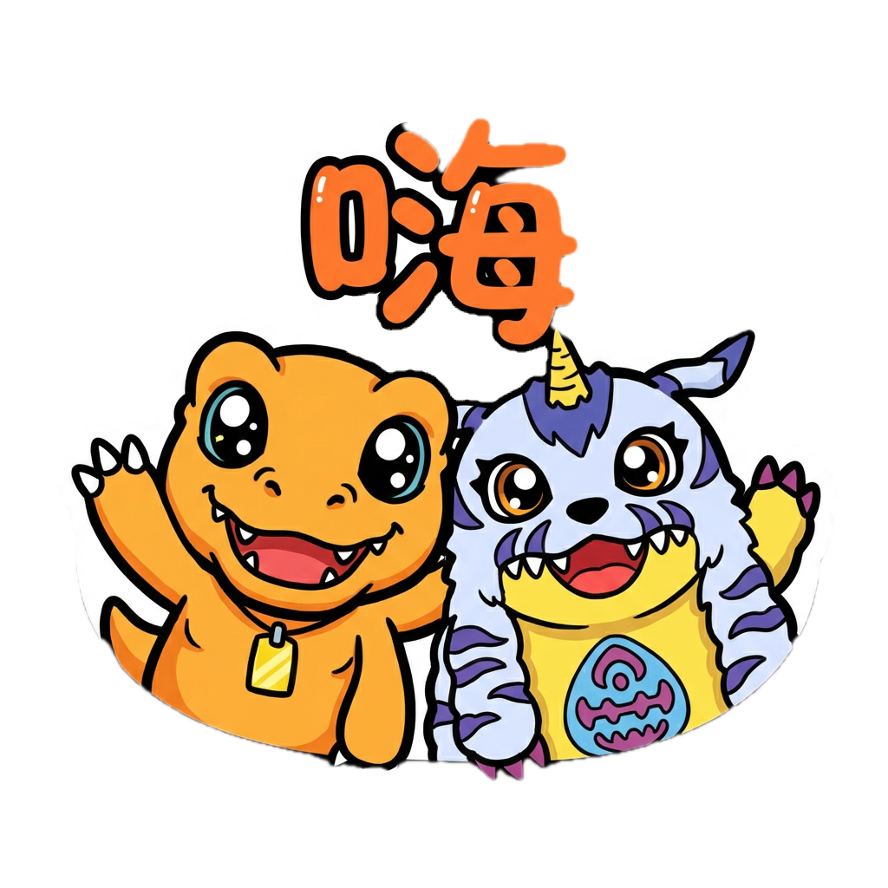
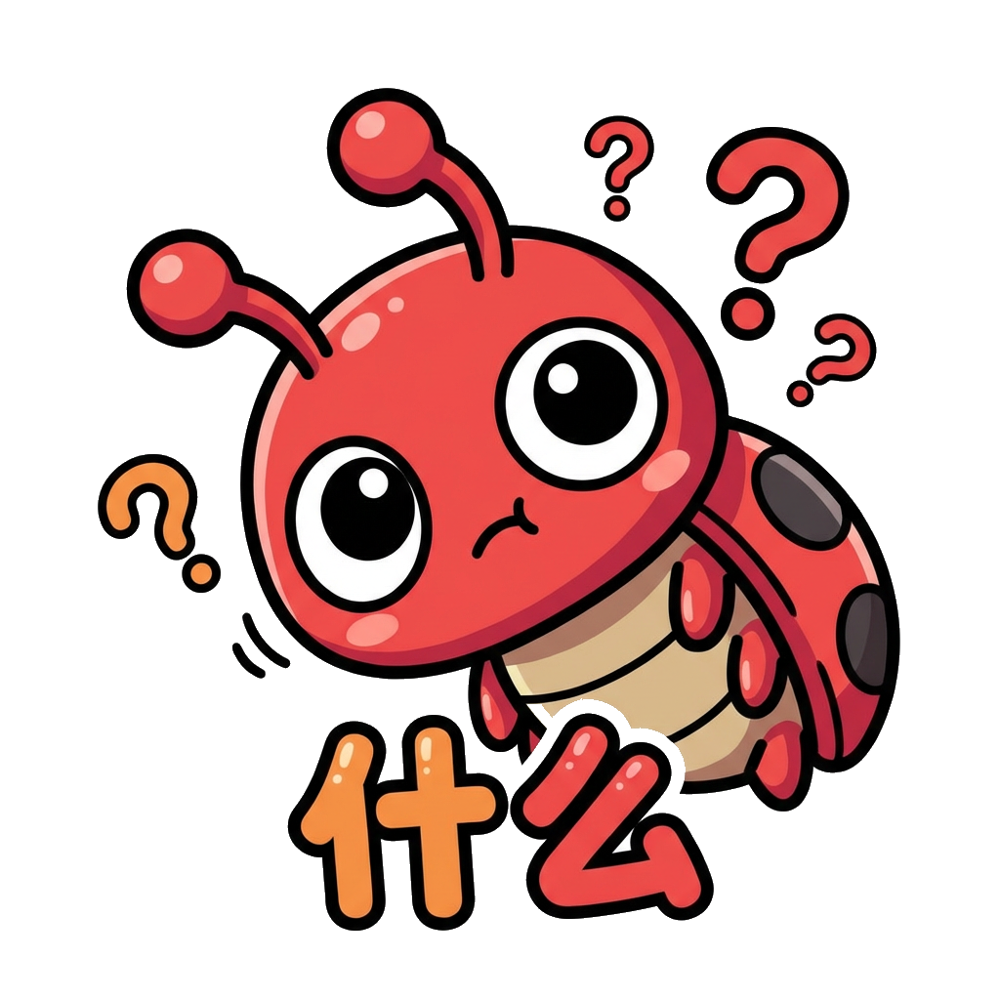

# WeChat Emoji Generator

输入角色描述或参考图片，自动生成一整套微信风格表情包。支持静态 PNG 和动态 GIF，透明背景，开箱即用。

支持 **Claude Code** 和 **OpenClaw** 两种 AI 编程助手。

## Features

- `/sticker` 一键生成整套表情包（8~24 张）
- 支持纯文字描述角色 或 参考图片生成
- 静态 PNG（Gemini 3 Pro）+ 动态 GIF（Sora 2）
- 自动去除白色背景，输出透明底
- 预置 24 个常用微信表情（OK、谢谢、早安、加油...）
- 可自定义表情列表和数量

## Demo：数码宝贝第一代表情包

> `/sticker 数码宝贝第一代，8只数码宝贝 --gif --count 8`

### 静态版

<p>







</p>

### 动态版

<p>


</p>

## Quick Start

### 1. 安装依赖

```bash
brew install jq imagemagick ffmpeg
```

### 2. 配置 API Key

```bash
export PPIO_API_KEY=your_ppio_api_key
```

API 来自 [PPIO](https://ppio.com)，使用 Gemini 3 Pro（图片生成）和 Sora 2（视频生成）。

### 3. 使用

<details>
<summary><b>Claude Code</b></summary>

```bash
# 进入项目目录
cd wechatemoji

# 启动 Claude Code，然后输入：

# 纯文字生成静态表情包
/sticker 一只圆滚滚的橘色小猫，大眼睛，短尾巴

# 指定数量
/sticker 一只绿色小恐龙 --count 8

# 生成动态 GIF
/sticker 一只白色柴犬 --gif --count 8

# 基于参考图片
/sticker /path/to/character.png 生成可爱贴纸风格

# 自定义表情列表
/sticker 一只白色小狗 --emotions "开心,难过,生气,吃饭,睡觉,撒娇"

# 混合模式：大部分静态，指定几个做动画
/sticker 一只蓝色小鲸鱼 --gif-only "嗨,开心,再见"
```

</details>

<details>
<summary><b>OpenClaw</b></summary>

```bash
# 方式一：手动安装
cp -r openclaw/wechat-sticker ~/.openclaw/skills/wechat-sticker

# 方式二：直接在 OpenClaw 聊天中粘贴本仓库链接，自动安装

# 然后输入：
/sticker 一只圆滚滚的橘色小猫，大眼睛，短尾巴
/sticker 一只绿色小恐龙 --gif --count 8
```

</details>

## 项目结构

```
wechatemoji/
├── .claude/skills/
│   └── sticker.md              # Claude Code Skill 定义
├── openclaw/wechat-sticker/
│   ├── SKILL.md                # OpenClaw Skill 定义
│   └── scripts/                # 脚本副本（独立运行）
├── scripts/
│   ├── generate_stickers.sh    # 静态图生成（Gemini 3 Pro API）
│   ├── generate_animated_sticker.sh  # 动态图生成（Sora 2 API）
│   └── remove_bg.sh           # 去白背景（ImageMagick floodfill）
└── output/stickers/            # 生成结果
```

## 工作流程

```
用户输入角色描述
    │
    ▼
Claude 构建 prompt（角色 × 表情 × 风格）
    │
    ├─── 静态 ──▶ Gemini 3 Pro text-to-image ──▶ PNG
    │                                              │
    └─── 动态 ──▶ 先生成静态 PNG ──▶ Sora 2 img2video ──▶ ffmpeg ──▶ GIF
                                                   │
                                                   ▼
                                        ImageMagick 去白背景
                                                   │
                                                   ▼
                                           透明背景表情包 ✓
```

## API

| 功能 | API | 说明 |
|------|-----|------|
| 静态图生成 | Gemini 3 Pro text-to-image | 1024×1024, 1:1 |
| 静态图编辑 | Gemini 3 Pro image-edit | 基于参考图 |
| 动画生成 | Sora 2 img2video | 4s, 720p, 异步 |
| 任务查询 | async/task-result | 轮询异步任务 |

## 默认表情列表

| OK | 谢谢 | 早安 | 晚安 | 嗨 | 呵呵 |
|:---:|:---:|:---:|:---:|:---:|:---:|
| 爱你 | 什么 | 震惊 | 拜托 | 加油 | 鼓掌 |
| 紧张 | 累了 | 生气 | 抱歉 | 不行 | 了解 |
| 对对对 | 没问题 | 哭了 | 开心 | 吃饭 | 再见 |

## License

MIT
